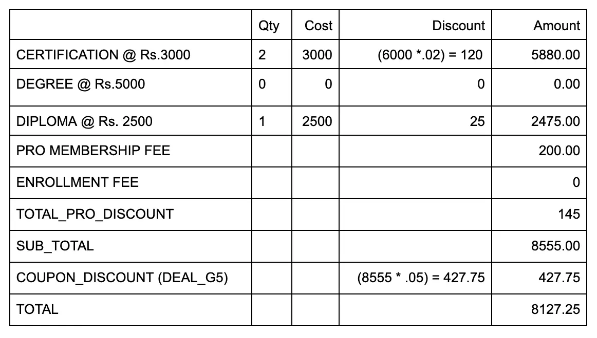

## 🎟️ Coupons

Geekdemy offers various discount coupons based on purchase criteria. **Only one valid coupon** can be applied per transaction.

### ✅ Available Coupons

- **B4G1**  
  Automatically applied when purchasing **4 or more** programmes.  
  ➤ The **lowest-priced** programme is given **for free**.

- **DEAL_G20**  
  Applicable when the **programme subtotal is ₹10,000 or more**.  
  ➤ Provides a **20% discount** on the total programme cost.  
  ➤ Must be **explicitly applied** via `APPLY_COUPON` command.

- **DEAL_G5**  
  Applicable when purchasing **at least 2 programmes**.  
  ➤ Provides a **5% discount** on the total programme cost.  
  ➤ Must be **explicitly applied** via `APPLY_COUPON` command.

---

## 🧾 Enrollment Fee

An **enrollment fee** of ₹500 is **added** if the final programme cost **after discount** is **less than ₹6666**.  
If the final cost is **₹6666 or more**, the enrollment fee is **waived**.

---

## 👑 Pro Membership

A **Pro Membership** can be purchased for a **flat fee of ₹200**.  
It provides **additional discounts per programme category**, on top of other coupons.

### 🔻 Pro Membership Discounts

| Programme Type | Discount |
|----------------|----------|
| DIPLOMA        | 1%       |
| CERTIFICATION  | 2%       |
| DEGREE         | 3%       |

---

## 🖼️ Coupon Rules Illustration

