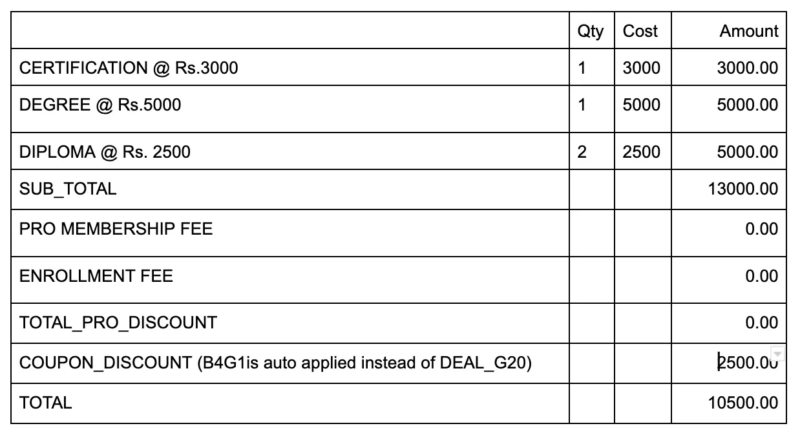

## 📥 Input Commands

Your program should accept the following input commands:

### `ADD_PROGRAMME <CATEGORY> <QUANTITY>`
Adds the specified quantity of a programme category to the cart.

- **Example:**  
  `ADD_PROGRAMME CERTIFICATION 1`

### `APPLY_COUPON <COUPON_NAME>`
Applies a discount coupon to the total purchase value.

- **Example:**  
  `APPLY_COUPON DEAL_G20`

### `ADD_PRO_MEMBERSHIP`
Adds a Pro Membership to the cart, enabling special discounts on each programme.

- **Example:**  
  `ADD_PRO_MEMBERSHIP`

### `PRINT_BILL`
Prints the detailed bill including all charges and discounts.

---

## 📤 Output Format

Your program should print the following information as part of the bill:

### `SUB_TOTAL <AMOUNT>`
Total cost of all programmes after applying Pro Membership discounts (if any).

### `COUPON_DISCOUNT <COUPON_NAME> <AMOUNT>`
Displays the applied coupon name and discount amount.  
If the coupon is not applicable, output:
```
DISCOUNT NONE 0
```

### `TOTAL_PRO_DISCOUNT <AMOUNT>`
Total discount applied due to Pro Membership.

### `PRO_MEMBERSHIP_FEE <AMOUNT>`
Fee for the Pro Membership, if added.

### `ENROLLMENT_FEE <AMOUNT>`
Additional enrollment fee (if applicable).

### `TOTAL <AMOUNT>`
Final payable amount after all discounts and fees.

---

## 🧪 Sample Input/Output

### 🧾 Sample 1

**Input:**
```
ADD_PROGRAMME CERTIFICATION 1
ADD_PROGRAMME DEGREE 1
ADD_PROGRAMME DIPLOMA 2
APPLY_COUPON DEAL_G20
PRINT_BILL
```

**Output:**
```
SUB_TOTAL 13000.00
COUPON_DISCOUNT DEAL_G20 2500.00
TOTAL_PRO_DISCOUNT 0.00
PRO_MEMBERSHIP_FEE 0.00
ENROLLMENT_FEE 0.00
TOTAL 10500.00
```

### 💡 Sample 2

**Input:**
```
ADD_PROGRAMME DEGREE 1
ADD_PROGRAMME DIPLOMA 2
APPLY_COUPON DEAL_G20
APPLY_COUPON DEAL_G5
PRINT_BILL
```

**Output:**
```
SUB_TOTAL 10000.00
COUPON_DISCOUNT DEAL_G20 2000.00
TOTAL_PRO_DISCOUNT 0.00
PRO_MEMBERSHIP_FEE 0.00
ENROLLMENT_FEE 0.00
TOTAL 8000.00
```

---

## 🖼️ Input Format Illustration



---

## 📌 Notes

- Only **one valid coupon** is applied per purchase (the first applicable one).
- Pro Membership offers specific discounts per programme category.
- Membership and enrollment fees are added only if applicable.